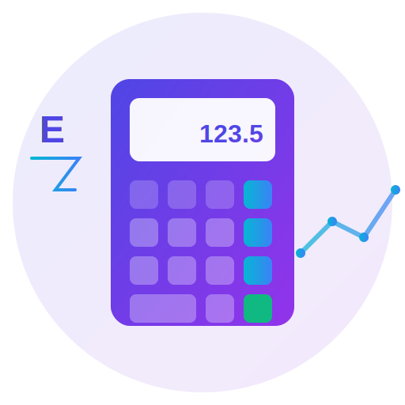

# Estimatix - Professional Estimation & Quotation Platform

<div align="center">
  
  
  **Modern SaaS Platform for Professional Estimations**
  
  [](https://github.com/shubhamWithProgram/estimatix)
  [](LICENSE)
  [](CONTRIBUTING.md)
</div>

---

## 🚀 Features

### 🆕 Enhanced Multi-Item Calculator (October 2025) ⭐ AI-POWERED
The Multi-Item Quotation Calculator has been transformed into a **world-class professional system** with **28 production-ready features** across 6 categories:

| Category | Features | Impact |
|----------|----------|--------|
| 🧠 **Smart Logic** | 5 features | Accuracy & Efficiency |
| 🚀 **Productivity** | 5 features | Faster Workflow |
| 🎨 **Visual** | 6 features | Cleaner UX |
| ⚙️ **Automation** | 4 features | Reliability |
| 💼 **Business** | 4 features | Professional Edge |
| 📢 **Marketing** | 4 features | Modern Touch |

#### � AI-Assisted Estimation ⭐ NEW!
- **One-click intelligent auto-fill** - AI analyzes and suggests optimal configurations
- **4 AI Modes**: Residential, Commercial, Thermal, Premium
- **8 preset configurations** - Small to Extra-Large for both windows and doors
- **AI confidence scoring** - Shows estimation reliability
- **Cost impact preview** - See financial implications before applying
- **Smart reasoning** - Explains why each choice was made
- **Premium modal interface** - Professional presentation

#### �🧮 Smart Auto-Calculation
- **Real-time calculations** as you type (Excel-like experience)
- Auto-calculated: Glass Area, Frame Weight, All Costs
- Frame weight varies by type (Standard, Heavy Duty, UPVC, etc.)
- Visual indicators for auto-calculated fields

#### 💡 Intelligent Recommendations
- **Context-aware suggestions** based on dimensions and materials
- Sliding mechanism alerts for large windows (>2m)
- Glass type recommendations for safety
- Security suggestions for doors
- Weather strip alerts for large openings

#### 📊 Live Summary Footer
- **Always-visible sticky footer** with totals
- Shows: Items, Area, Weight, Grand Total
- Quick action buttons: WhatsApp, Email, PDF
- Pulsing animation for visibility

#### 🔖 Template System
- Save common configurations as reusable templates
- One-click insertion from template library
- Perfect for frequently-used setups

#### 📋 Productivity Features
- **Clone/Duplicate items** with one click
- **Drag-and-drop reordering** with visual feedback
- **Auto-numbering** that updates dynamically
- **Auto-save** every 2 seconds (Google Docs style)
- **Draft recovery** on page reload

#### 🧾 Cost Transparency
- Expandable **cost breakdown per item**
- Shows: Glass, Frame, Accessories, Labor costs
- Professional presentation for customers

#### 📱 Direct Communication
- **WhatsApp integration** - Pre-filled messages
- **Email integration** - Professional templates
- One-click sharing from sticky footer

#### 📅 Smart Tracking
- **30-day auto expiry** on quotations
- **Status badges**: Draft, Finalized, Sent
- Visual warnings for expired quotes

**📖 Documentation**: See `MULTI_ITEM_CALCULATOR_ENHANCEMENTS.md` for detailed features

---

### Core Functionality
- **Multi-Item Quotations**: Create detailed quotations with multiple items
- **Smart Calculator**: Quick single-item estimations
- **PDF Generation**: Professional PDF quotations with custom branding
- **Share Quotes**: Generate shareable links for quotes
- **Subscription Management**: Integrated Stripe billing
- **Multi-Tenant Support**: Customizable per client/tenant

### Technical Features
- ⚡ **Fast**: Built with Vite + React
- 🔐 **Secure**: Firebase Authentication
- 📱 **Responsive**: Mobile-first design
- 🎨 **Modern UI**: Bootstrap 5 + Custom CSS
- 📄 **PWA Ready**: Installable as app
- 🔄 **Real-time**: Live data sync
- 📊 **Analytics**: Track usage and metrics

---

## 🎨 Branding

**Estimatix** represents professional estimation services with a modern, trustworthy identity.

- **Colors**: Indigo (#4f46e5) to Purple (#9333ea) gradient
- **Style**: Clean, minimal, glassmorphism
- **Theme**: Calculator + Analytics fusion

---

## 📦 Installation

```bash
# Clone the repository
git clone https://github.com/shubhamWithProgram/estimatix.git

# Navigate to project directory
cd estimatix

# Install dependencies
npm install

# Create .env.local file (see env.example)
cp env.example .env.local

# Start development server
npm run dev
```

---

## 🔧 Configuration

### Environment Variables

Create `.env.local` with your Firebase config:

```env
VITE_FIREBASE_API_KEY=your_api_key
VITE_FIREBASE_AUTH_DOMAIN=your_project.firebaseapp.com
VITE_FIREBASE_PROJECT_ID=your_project_id
VITE_FIREBASE_STORAGE_BUCKET=your_project.storage app
VITE_FIREBASE_MESSAGING_SENDER_ID=your_sender_id
VITE_FIREBASE_APP_ID=your_app_id
VITE_STRIPE_PUBLISHABLE_KEY=your_stripe_key
```

### PWA Setup

Before deploying, generate PNG logos:

```bash
# Upload public/logo.svg to https://convertio.co/svg-png/
# Export as 192x192 → save as public/logo192.png
# Export as 512x512 → save as public/logo512.png
```

---

## 🏗️ Project Structure

```
estimatix/
├── src/
│   ├── components/       # React components
│   │   ├── Auth.tsx
│   │   ├── Calculator.jsx
│   │   ├── Dashboard.tsx
│   │   ├── MultiItemCalculator.tsx
│   │   └── ResponsiveHeader.tsx
│   ├── lib/              # Services & utilities
│   │   ├── auth.tsx
│   │   ├── firebase.ts
│   │   ├── pdfService.ts
│   │   └── shareService.ts
│   ├── App.tsx           # Main app component
│   └── main.ts           # Entry point
├── public/
│   ├── logo.svg          # Main logo
│   ├── favicon.svg       # Favicon
│   └── manifest.webmanifest
├── functions/            # Firebase Cloud Functions
└── vite.config.ts        # Vite configuration
```

---

## 🚀 Deployment

### GitHub Pages

```bash
# Build for production
npm run build

# Deploy to GitHub Pages
npm run deploy
```

Your app will be live at: `https://shubhamWithProgram.github.io/estimatix/`

### Firebase Hosting

```bash
# Build the app
npm run build

# Deploy to Firebase
firebase deploy
```

---

## 📱 Usage

### For End Users

1. **Sign Up/Login**: Create account or login
2. **Create Estimate**: 
   - Use Quick Calculator for single items
   - Use Multi-Item for detailed quotes
3. **Generate PDF**: Download professional quotations
4. **Share**: Generate shareable links
5. **Manage Subscription**: Upgrade/downgrade plans

### For Administrators

1. **Admin Settings**: Configure pricing, terms
2. **User Management**: View and manage users
3. **Analytics**: Track platform usage
4. **Branding**: Customize per-tenant branding

---

## 🛠️ Tech Stack

- **Frontend**: React 19, TypeScript, Vite
- **UI Framework**: Bootstrap 5
- **Authentication**: Firebase Auth
- **Database**: Firestore
- **Payment**: Stripe
- **PDF Generation**: jsPDF + jspdf-autotable
- **Icons**: Bootstrap Icons
- **Routing**: React Router v6

---

## 📄 Scripts

```json
{
  "dev": "Start development server",
  "build": "Build for production",
  "preview": "Preview production build",
  "deploy": "Deploy to GitHub Pages"
}
```

---

## 🤝 Contributing

Contributions are welcome! Please feel free to submit a Pull Request.

1. Fork the repository
2. Create your feature branch (`git checkout -b feature/AmazingFeature`)
3. Commit your changes (`git commit -m 'Add some AmazingFeature'`)
4. Push to the branch (`git push origin feature/AmazingFeature`)
5. Open a Pull Request

---

## 📝 License

This project is licensed under the MIT License - see the [LICENSE](LICENSE) file for details.

---

## 📧 Contact

- **Email**: info@estimatix.com
- **GitHub**: [@shubhamWithProgram](https://github.com/shubhamWithProgram)

---

## 🙏 Acknowledgments

- Bootstrap team for the amazing UI framework
- Firebase for authentication and database
- Stripe for payment processing
- React team for the excellent library

---

<div align="center">
  Made with ❤️ by the Estimatix Team
  
  **Estimatix** - Professional Estimation & Quotation Platform
</div>
